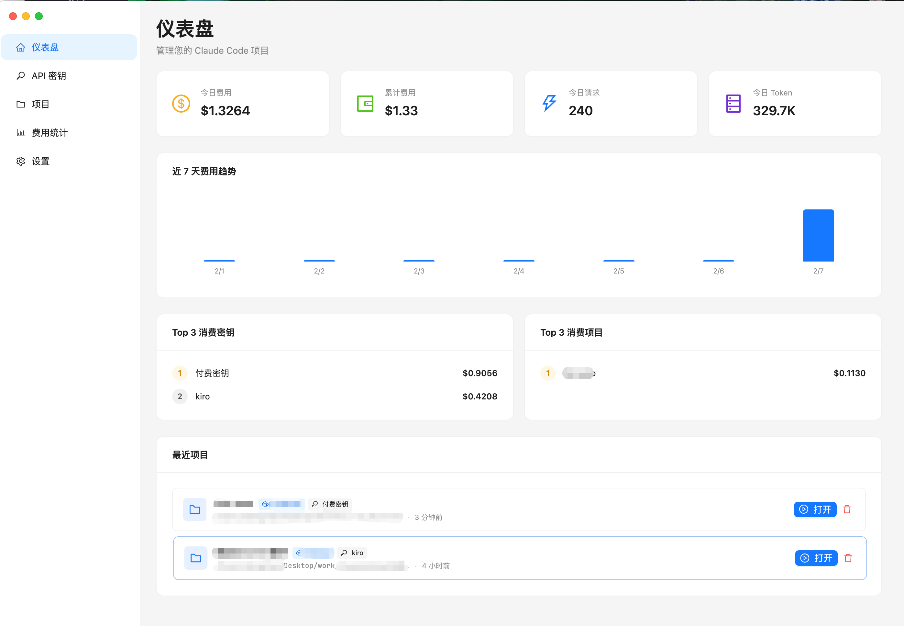
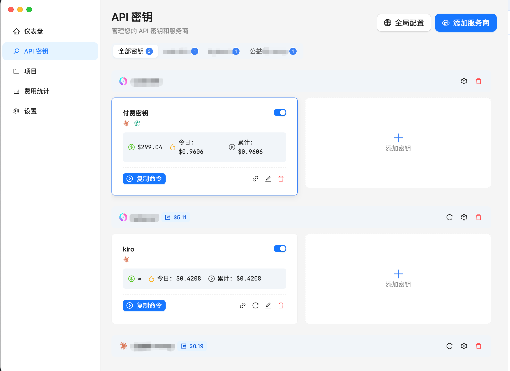
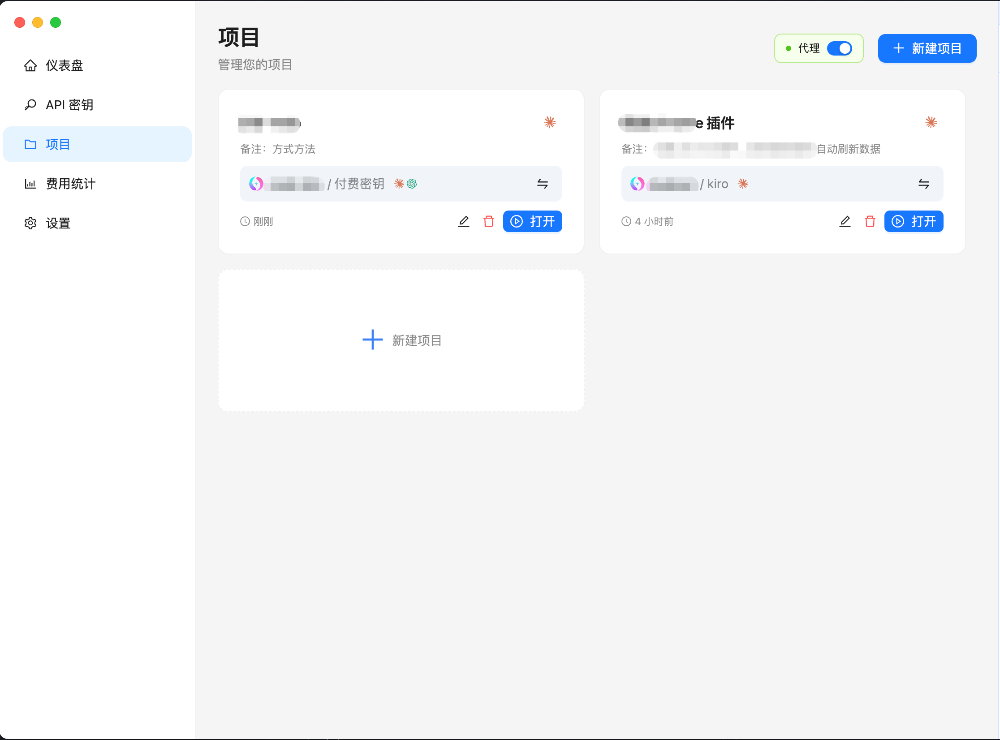
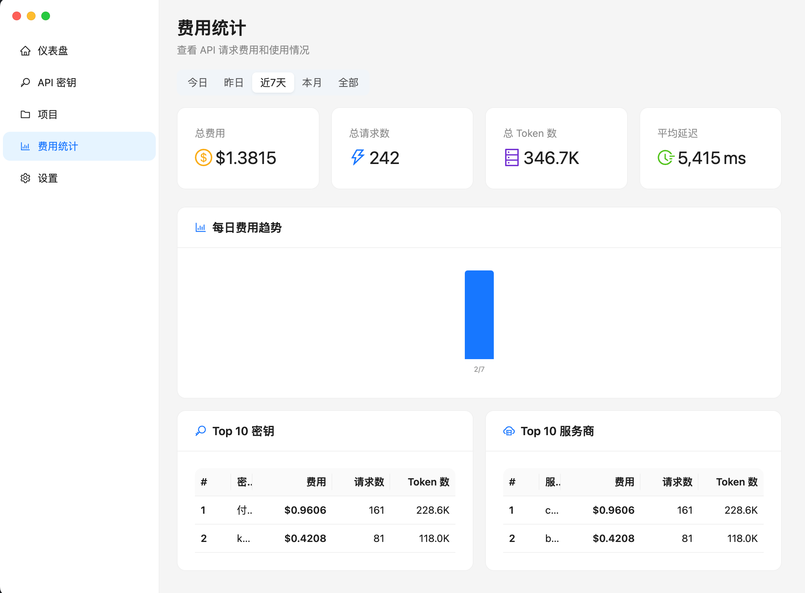
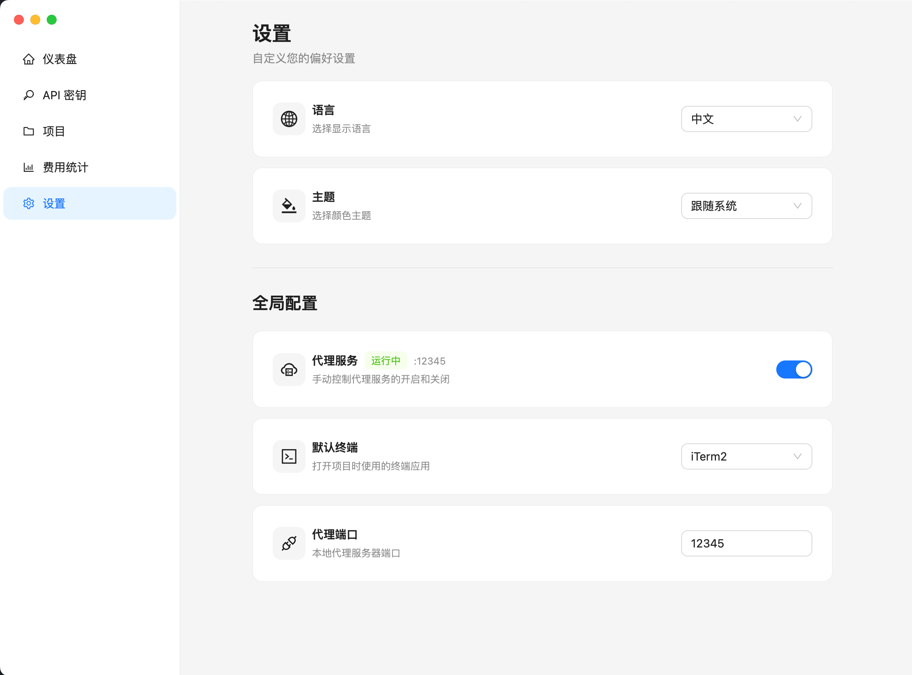

# CC Use

专为 **Claude Code / Codex CLI** 打造的桌面配置管理工具。不同于通用的 API 管理平台，CC Use 只做一件事：让你更高效地管理和使用 CLI。

[English](./README_EN.md)

> **从 cc-switch 迁移？** 请参阅 [从 cc-switch 迁移](#从-cc-switch-迁移)。

## 截图

|                 仪表盘                 |               密钥管理               |
| :------------------------------------: | :----------------------------------: |
|  |  |

|                项目管理                |               统计                |
| :------------------------------------: | :-------------------------------: |
|  |  |

|                设置                 |
| :---------------------------------: |
|  |

## 功能

- **供应商与密钥管理** - 在「密钥」页面统一管理供应商和 API 密钥，每个密钥可同时支持 Claude Code 和 Codex CLI，支持额度查询（NewAPI / 自定义接口）
- **项目管理** - 创建项目并绑定供应商、密钥和 CLI 类型，支持在项目卡片上快速切换绑定
- **一键启动** - 点击项目即启动终端，自动注入环境变量，直接进入 CLI
- **本地代理** - 内置代理服务器，通过 session token 中转请求，开启后可实现费用追踪和热切换
- **费用追踪** - 代理模式下自动记录每次请求的 Token 用量和费用
- **统计分析** - 仪表盘展示今日费用、请求量、每日趋势、Top 密钥/项目；统计页提供按密钥/供应商/项目/模型的详细分析和请求明细
- **系统托盘** - 关闭窗口时最小化到托盘，代理服务持续运行；托盘菜单支持代理控制和最近项目快速启动
- **CLI 配置管理** - 支持全局配置和密钥级别的 CLI 配置（JSON），启动时自动合并注入
- **国际化** - 中文 / 英文界面
- **深色模式** - 亮色 / 深色主题切换

## 安装

从 [Releases](https://github.com/mipawn/cc-use/releases) 下载对应平台的安装包：

| 平台    | 格式                   |
| ------- | ---------------------- |
| macOS   | `.dmg` / `.zip`        |
| Windows | `.exe` (NSIS) / `.zip` |

## 使用方式

### 1. 添加供应商和密钥

进入「密钥」页面：

1. 点击「添加供应商」，填写名称、Base URL，选择图标，可选配置 Token 和余额查询
2. 在供应商分组下点击「添加密钥」，填写密钥值，选择支持的类型（Claude Code / Codex CLI），可选配置额度查询和 CLI 配置

### 2. 创建项目

进入「项目」页面，点击「添加项目」：

1. 填写项目名称，通过浏览按钮选择项目文件夹路径
2. 选择绑定的供应商和密钥（级联选择器）
3. 选择 CLI 类型（Claude Code / Codex CLI）

创建后可在项目卡片上快速切换绑定的密钥或 CLI 类型。

### 3. 启动终端

在「项目」页面或「仪表盘」的最近项目中，点击打开按钮即可启动终端。应用会自动启动代理并注入环境变量：

- **Claude Code**: 设置 `ANTHROPIC_BASE_URL` + `ANTHROPIC_API_KEY`
- **Codex CLI**: 设置 `OPENAI_BASE_URL` + `OPENAI_API_KEY`

### 4. 代理控制

在「项目」页面或「设置」页面可以开关本地代理。代理开启后：

- 请求经过本地代理中转，使用 session token 替代真实密钥
- 自动记录每次请求的 Token 用量和费用
- 支持不重启终端热切换密钥

关闭代理后将无法记录使用量。

## 工作原理

CC Use 支持两种工作模式：

**直连模式** - 终端直接使用真实密钥连接 API 供应商。

**代理模式** - 开启本地代理后，请求经过代理中转：

```
CLI → localhost:12345 (代理) → 实际 API 供应商
```

代理使用 session token 替代真实密钥，实现：

- 不暴露真实 API 密钥给终端环境
- 自动记录每次请求的 Token 用量和费用
- 支持不重启终端热切换密钥

## 从源码构建

```bash
# 安装依赖
pnpm install

# 开发模式
pnpm dev

# 构建生产版本
pnpm build

# 构建但不打包（用于测试）
pnpm build:unpack

# 类型检查
pnpm typecheck

# 代码检查
pnpm lint
```

## 技术栈

- **框架**: Electron + Vite
- **前端**: React 18 + TypeScript
- **UI**: Ant Design 6 + Tailwind CSS 4
- **状态管理**: Zustand
- **数据库**: SQLite (better-sqlite3) + Drizzle ORM
- **代理**: Express
- **国际化**: i18next

## 支持平台

- macOS (Apple Silicon / Intel)
- Windows (x64)

> ⚠️ **注意**：Windows 版本目前尚未经过充分测试，可能存在兼容性问题。如遇到问题，欢迎提交 [Issue](https://github.com/mipawn/cc-use/issues)。

## 从 cc-switch 迁移

CC Use v1.0.0 是全新的 Electron 桌面应用，与旧版 cc-switch CLI 工具不兼容。请先卸载旧版本：

```bash
cc-switch uninstall
```

如果 `cc-switch uninstall` 无法正常工作，手动清理：

```bash
sudo rm /usr/local/bin/cc-switch
rm -rf ~/.config/cc-switch
rm -f ~/.zsh/completions/_cc-switch
rm -f ~/.local/share/bash-completion/completions/cc-switch
rm -f ~/.config/fish/completions/cc-switch.fish
```

同时也清理旧版 cc-use CLI（如果安装过）：

```bash
sudo rm /usr/local/bin/cc-use
rm -rf ~/.config/cc-use
rm -f ~/.zsh/completions/_cc-use
rm -f ~/.local/share/bash-completion/completions/cc-use
rm -f ~/.config/fish/completions/cc-use.fish
```

清理完成后，从 [Releases](https://github.com/mipawn/cc-use/releases) 下载新版桌面应用即可。

## License

MIT
