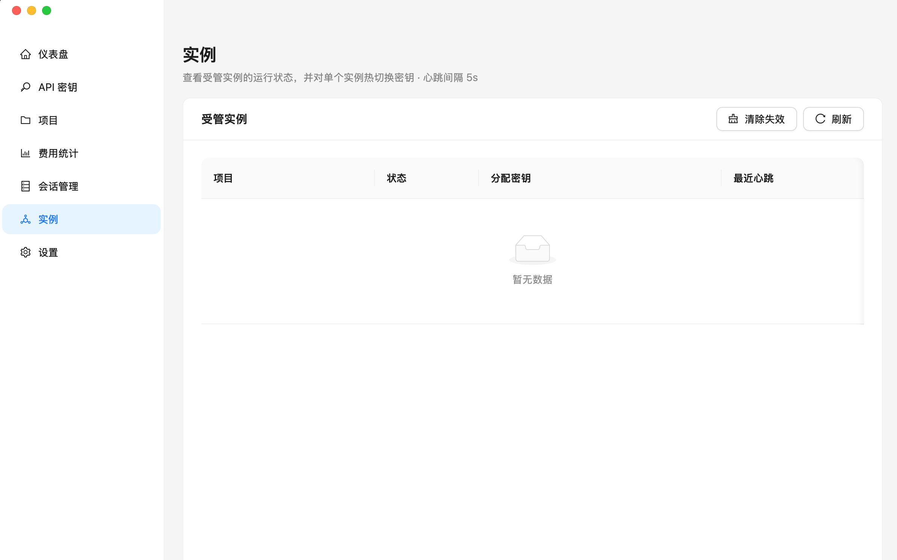

# CC Use

专为 **Claude Code / Grok Build / Codex Desktop / Claude Desktop** 打造的桌面配置管理工具。CC Use 负责管理供应商、密钥、本地网关与桌面端配置接管，让不同客户端共用一套可观测的密钥体系。

[English](./README_EN.md)

> **3.3.4 更新**：修复 Grok Build 前台启动与缺失 `model` 响应，自定义项目分组，按启动台隔离实例，并优化成功率与 Token 单位展示。
>
> **🎉 3.2.0 更新**：入口收敛为 Claude Code / Codex Desktop / Claude Desktop 三个客户端；Codex CLI 启动链路已移除，Codex Desktop 与 Claude Desktop 改为配置接管。详见 [CHANGELOG](./CHANGELOG.md)。
>
> **3.0 架构更新**：代理抽离为独立 `cc-use-daemon` 进程，实例身份在启动时显式建模。
>
> **⚠️ 平台变更**：自 3.0 起**仅支持 macOS**，不再提供 Windows 构建，也不再维护 Windows 相关代码。
>
> **历史迁移**：[从 1.x 迁移](./guides/MIGRATION.md) · [从 0.x (cc-switch) 迁移](./guides/MIGRATION_FROM_CC_SWITCH.md)

## 截图

|                 仪表盘                 |               密钥管理               |
| :------------------------------------: | :----------------------------------: |
|  |  |

|                项目管理                |               统计                |
| :------------------------------------: | :-------------------------------: |
|  |  |

|                设置                 |                实例                 |
| :---------------------------------: | :---------------------------------: |
|  |  |

## 功能

- **供应商与密钥管理** - 在「供应商密钥」页面统一管理供应商和 API 密钥；每个密钥可勾选 Claude Code、Grok Build、Codex Desktop、Claude Desktop，支持优先级排序、额度查询、费用倍率和模型映射
- **独立 CLI 工作区** - Claude Code 与 Grok Build 在侧边栏分别拥有启动台；项目目录可复用，但供应商、密钥、启动命令和运行实例按客户端隔离
- **自定义项目分组** - 创建或编辑项目时可输入新分组或复用已有分组；历史项目自动归入「未分组」，不再根据文件系统上级目录强制分组
- **CLI 一键启动** - 点击项目即启动终端，wrapper 自动注入 session token、实例标识和本地 daemon 地址，真实密钥不会进入终端环境
- **Codex Desktop 配置接管** - 写入 `~/.codex/config.toml` 的 `cc-use` provider 和固定 `experimental_bearer_token`，保留 `auth.json`；首次接管后重启 Codex Desktop，后续切换密钥可直接更新 daemon 路由
- **Claude Desktop 配置接管** - 写入 Claude 3P profile 和 configLibrary，网关地址指向 `http://127.0.0.1:<port>/claude-desktop`，支持配置预览、恢复官方配置和模型列表接管
- **本地 daemon 服务** - 独立常驻的 `cc-use-daemon` 进程作为本地网关，按 session token 路由到当前供应商/密钥，支持费用追踪与热切换
- **实例管理** - Claude Code 与 Grok Build 各自的「实例」Tab 只展示当前客户端启动的 managed instance，并且只能热切换到兼容密钥
- **费用追踪** - 自动记录每次请求的 Token 用量和费用；中文界面使用「万 / 亿」、英文界面使用 `K / M / B`，悬停可查看精确数量
- **统计分析** - 仪表盘展示今日费用、请求量、每日趋势、Top 密钥/项目；统计页提供按密钥/供应商/客户端/模型的详细分析和请求明细
- **系统托盘** - 关闭窗口时最小化到托盘，daemon 服务持续运行；托盘菜单支持服务控制和最近项目快速启动
- **自动更新** - 应用内检测并下载新版本，支持下载进度显示（`tauri-plugin-updater` 签名校验）
- **Claude Code 配置管理** - 支持全局配置和密钥级别局部配置（JSON），启动时自动合并注入；配置编辑入口位于 Claude Code 页面
- **国际化** - 中文 / 英文界面
- **深色模式** - 亮色 / 深色主题切换

## 安装

从 [Releases](https://github.com/mipawn/cc-use/releases) 下载 macOS 安装包：

| 平台  | 格式   |
| ----- | ------ |
| macOS | `.dmg` |

## 使用方式

### 1. 添加供应商和密钥

进入「供应商密钥」页面：

1. 点击「添加供应商」，填写名称、Base URL，选择图标，可选配置 Token 和余额查询
2. 在供应商分组下点击「添加密钥」，填写密钥值，选择适用客户端（Claude Code / Grok Build / Codex Desktop / Claude Desktop）
3. 按需配置费用倍率、额度查询和模型映射；只有 Claude Code 会展示局部 CLI 配置

### 2. 使用 Claude Code / Grok Build

进入侧边栏的「Claude Code」或「Grok Build」页面：

1. 在「项目」Tab 创建项目，设置自定义分组、项目文件夹、当前客户端的供应商和密钥
2. 点击项目打开按钮启动终端，应用会创建 managed instance
3. 在当前启动台的「实例」Tab 查看运行状态或切换兼容密钥，不会混入另一个 CLI 的实例
4. Claude Code 可在「全局配置」Tab 管理全局配置

Claude Code 启动时会设置 `ANTHROPIC_BASE_URL`；Grok Build 会在 `~/.grok/config.toml` 中维护 `cc-use` 自定义模型，通过 `CC_USE_GROK_TOKEN` 注入 session token，并以前台 TUI 方式运行。两者都只连接本地 daemon，真实密钥保留在 daemon 中。详细配置与排障参见 [Grok Build 接入指南](./guides/GROK_BUILD.md)。

### 3. 接管 Codex Desktop

进入「Codex Desktop」页面：

1. 选择支持 Codex Desktop 的密钥
2. 点击接管，CC Use 会写入 `~/.codex/config.toml`，并备份 `config.toml` / `auth.json`
3. 首次接管或恢复官方配置后，重启 Codex Desktop 让配置生效

接管不会改写 `auth.json`，会保留官方 ChatGPT 登录和插件能力。已接管状态下切换密钥只更新 daemon session 指向，Codex Desktop 下一次请求即可走新密钥。

### 4. 接管 Claude Desktop

进入「Claude Desktop」页面：

1. 选择支持 Claude Desktop 的密钥
2. 点击接管，CC Use 会写入 Claude 3P profile、`_meta.json` 和对应配置文件
3. 可随时查看配置预览或恢复官方配置

Claude Desktop 接管前会探测本地 daemon 的模型列表接口；模型映射会同步到 Claude Desktop 的 inference model 展示。

### 5. daemon 服务

本地 daemon 服务随应用启动并常驻运行，终端总是经它中转：

- 请求使用 session token 替代真实密钥
- 自动记录每次请求的 Token 用量和费用
- 支持热切换密钥：Claude Code / Grok Build 在「实例」页切换当前运行实例；Codex Desktop / Claude Desktop 通过固定配置接管 token 更新 daemon 路由

在「设置」页面可以查看服务运行状态和端口，异常时点击「重启服务」。

### 6. 识别当前实例 · Claude Code Status Line

启动终端时，cc-use 会给子进程注入一组环境变量，用来识别当前窗口对应的 managed instance：

| 变量                      | 说明                                                  |
| ------------------------- | ----------------------------------------------------- |
| `CC_USE_INSTANCE_ID`      | 实例 UUID，对应「实例」页中的一条记录                 |
| `CC_USE_INSTANCE_LABEL`   | 短码（session token 后 8 位），适合展示在状态栏       |
| `CC_USE_PROXY_PORT`       | 本地 daemon 端口                                      |
| `CC_USE_MANAGEMENT_TOKEN` | 管理 token，**不要展示**，仅供 wrapper 与 daemon 通信 |

多开窗口时，推荐把 `CC_USE_INSTANCE_LABEL` 挂到 Claude Code 的 [statusLine](https://docs.claude.com/en/docs/claude-code/statusline) 上，一眼区分当前窗口跑的是哪条实例。

**作者本人使用 [claude-hud](https://github.com/jarrodwatts/claude-hud)**：通过它的 `--extra-cmd` 选项把 `CC_USE_INSTANCE_LABEL` 以 `{"label":"..."}` JSON 的形式塞进 claude-hud 渲染的状态栏。参考 `~/.claude/settings.json`：

```jsonc
{
  "statusLine": {
    "type": "command",
    "command": "bash -lc 'hud_dir=$(ls -td ~/.claude/plugins/cache/claude-hud/claude-hud/*/ 2>/dev/null | head -1); [ -n \"$hud_dir\" ] || exit 0; bun \"${hud_dir}src/index.ts\" --extra-cmd \"bash -lc '\\''[ -n \\\"\\$CC_USE_INSTANCE_LABEL\\\" ] && printf \\\"{\\\\\\\"label\\\\\\\":\\\\\\\"%s\\\\\\\"}\\\" \\\"\\$CC_USE_INSTANCE_LABEL\\\"'\\''\"'",
  },
}
```

安装步骤：在 Claude Code 中执行 `/plugin marketplace add jarrodwatts/claude-hud` → `/plugin install claude-hud` → `/claude-hud:setup`，然后把生成的 `statusLine.command` 按上面的样子补上 `--extra-cmd`。

不用 claude-hud 也可以：任何能读取 `$CC_USE_INSTANCE_LABEL` 并输出一行文本的命令，都能作为 `statusLine` 使用。

## 工作原理

应用启动时会自动拉起独立的 `cc-use-daemon` 进程作为本地网关。不同客户端通过不同方式接入同一个 daemon：

```
Claude Code wrapper → localhost:12345 (daemon) → 实际 API 供应商
Grok Build wrapper → localhost:12345/v1 (daemon) → 实际 API 供应商
Codex Desktop config.toml → localhost:12345/v1 (daemon) → 实际 API 供应商
Claude Desktop 3P gateway → localhost:12345/claude-desktop (daemon) → 实际 API 供应商
```

daemon 做这些事：

- 用 session token 路由到对应供应商/密钥，不把真实密钥暴露给客户端配置或终端环境
- 自动记录每次请求的 Token 用量和费用
- 支持热切换密钥
- 通过 wrapper 的 heartbeat + stop 上报追踪每个 managed instance 的生命周期
- 按供应商类型补齐正确认证 Header，并透传客户端原始请求形态
- 普通 HTTP 请求会原样透传 `User-Agent`；WebSocket 升级握手会由 daemon 重建必要请求头
- 对 Grok Build 的 OpenAI Chat Completions 响应做最小兼容：上游遗漏 `model` 时，非流式响应和 SSE 分块都会使用实际请求模型补齐

> 3.2.0 已移除旧的请求/响应格式转换层。上游供应商需要兼容对应客户端发出的 API 形态：Claude Code / Claude Desktop 使用 Anthropic Messages 风格，Grok Build / Codex Desktop 使用 OpenAI 风格。

## 从源码构建与测试

```bash
# 安装依赖
pnpm install

# 开发模式
pnpm dev

# 构建生产版本
pnpm build

# 构建开发版本（用于测试）
pnpm build:dev

# 前端测试（兼容入口）
pnpm test

# Rust 测试
cargo test --workspace

# 类型检查
pnpm typecheck

# 代码检查
pnpm lint

# 代码格式化
pnpm format
```

## 技术栈

- **框架**: Tauri 2.x + Vite
- **后端**: Rust (axum, rusqlite, tokio)
- **前端**: React 18 + TypeScript
- **UI**: Ant Design 6 + Tailwind CSS 4
- **状态管理**: Zustand
- **数据库**: SQLite (rusqlite)
- **Daemon**: 独立 `cc-use-daemon` 进程（Axum + Hyper）
- **国际化**: i18next + sys-locale

## 支持平台

- macOS (Apple Silicon / Intel)

> ⚠️ **注意**：自 3.0 起不再提供 Windows 构建，也不再维护 Windows 相关代码。Windows 用户请停留在 2.3.x，该版本不再收到更新。

## License

MIT
