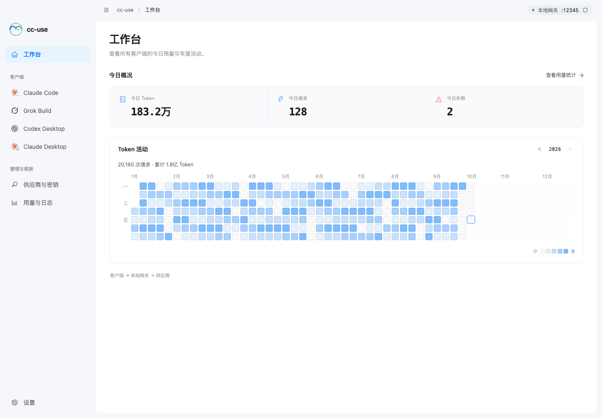
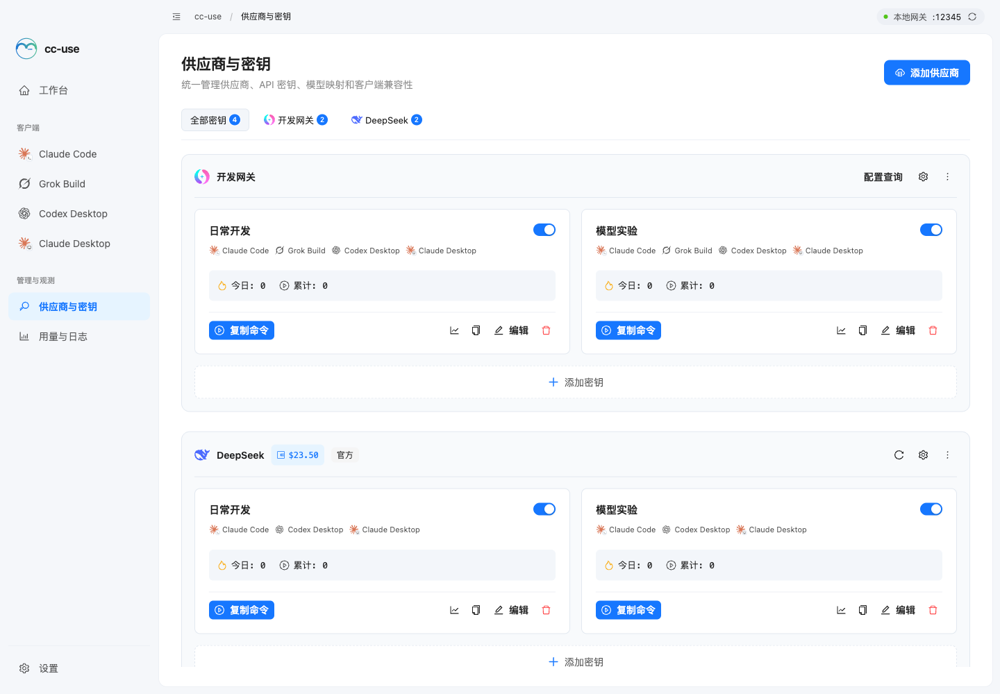
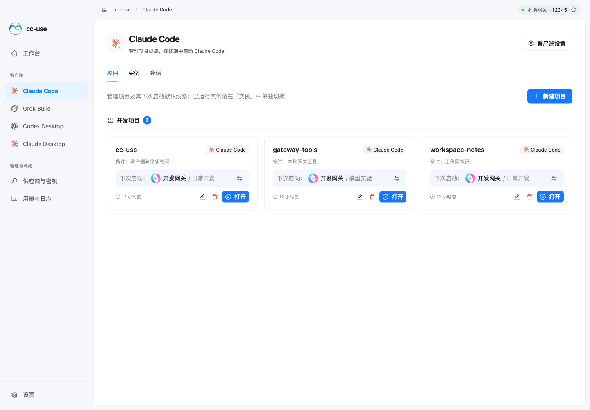
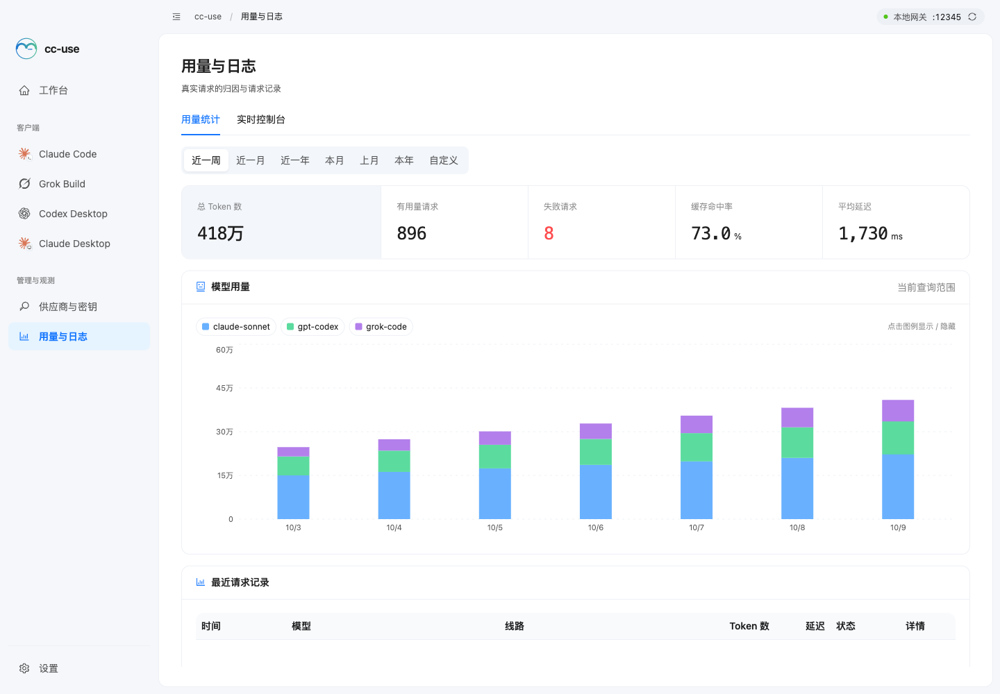
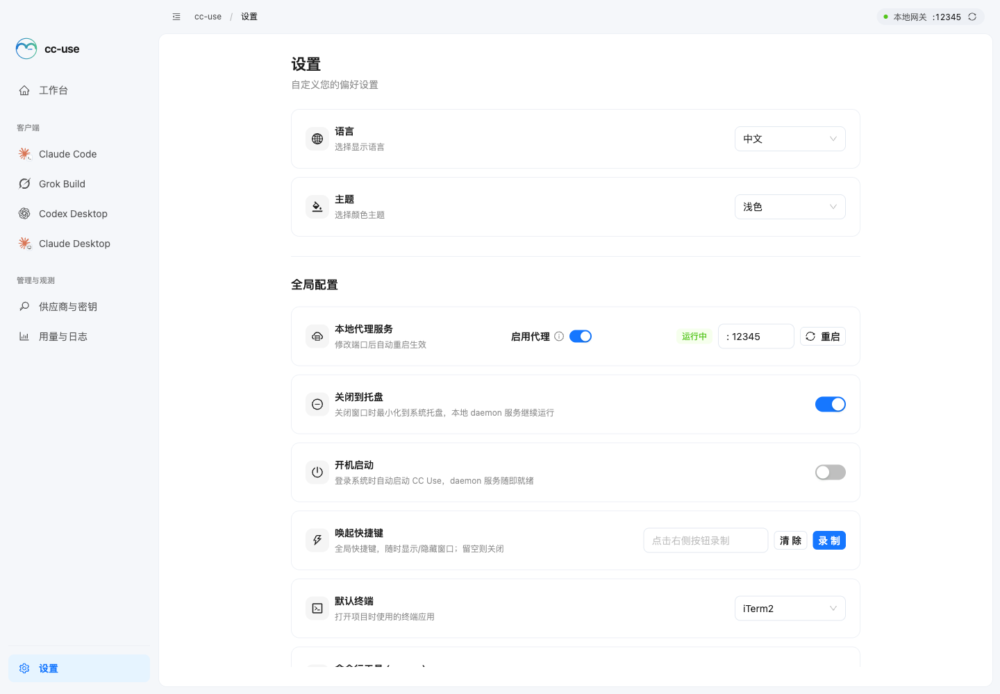
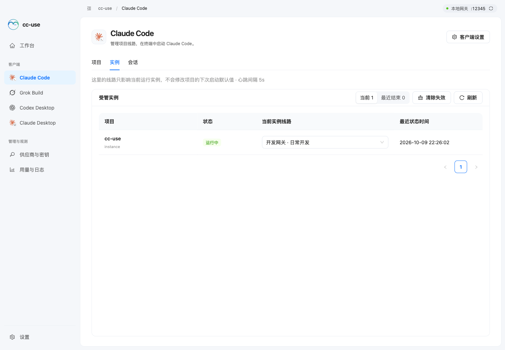

# CC Use

A desktop configuration manager for **Claude Code / Grok Build / Codex Desktop / Claude Desktop**. CC Use manages providers, keys, the local gateway, and desktop config takeover so multiple clients can share one observable key system.

[中文文档](./README.md)

> **3.12.1 Update**: Model usage charts now use a muted palette across legends, stacked bars, and tooltips in both light and dark themes. See [CHANGELOG](./CHANGELOG.md).
>
> **3.0 Architecture Update**: The local proxy is now an independent `cc-use-daemon` process, with instance identity explicitly modeled at launch time.
>
> **⚠️ Platform change**: Starting from 3.0, **only macOS is supported** — Windows builds are no longer published, and Windows-specific code is no longer maintained.
>
> **Historical migrations**: [From 1.x](./guides/MIGRATION_EN.md) · [From 0.x (cc-switch)](./guides/MIGRATION_FROM_CC_SWITCH_EN.md)

## Screenshots

These screenshots show the current UI using demo data.

|                    Workspace                    |                      Providers & Keys                      |
| :---------------------------------------------: | :--------------------------------------------------------: |
|  |  |

|                    Client Projects                     |                     Usage & Logs                      |
| :----------------------------------------------------: | :---------------------------------------------------: |
|  |  |

|                     Settings                      |                      Running Instances                      |
| :-----------------------------------------------: | :---------------------------------------------------------: |
|  |  |

## Features

- **Provider & Key Management** - Manage providers and API keys on the unified Keys page; each key can target Claude Code, Grok Build, Codex Desktop, and Claude Desktop, with priority ordering, balance/usage queries, and model mapping
- **Separate CLI Workspaces** - Claude Code and Grok Build each have their own launchpad in the sidebar; project directories can be reused, while provider, key, pre-launch command, and runtime instances stay isolated per client
- **Custom Project Groups** - Create or reuse named groups when editing a project; legacy projects fall back to Ungrouped instead of being forced into filesystem parent-directory groups
- **CLI Launch** - Click a project to launch a terminal; the wrapper injects a session token, instance metadata, and the local daemon URL while keeping the real key out of the terminal environment
- **Command & Optional Status Line** - `cc-use claude` and `cc-use grok` show an arrow-key route picker with the GUI default preselected; users may opt into a two-line color Claude Code HUD
- **Codex Desktop Config Takeover** - Preserves `auth.json` and official login while loading the selected route's real model catalog; DeepSeek exposes Flash / Pro and their reasoning levels, while key-level model mapping only renames the upstream model and never converts the Responses protocol
- **Claude Desktop Config Takeover** - Writes a Claude 3P profile and configLibrary entries pointing to `http://127.0.0.1:<port>/claude-desktop`, with config preview, official restore, and model-list takeover
- **Local Daemon Service** - A standalone `cc-use-daemon` process acts as the local gateway, routing by session token to the current provider/key and enabling usage tracking and hot-switching
- **Instance Management** - Each launchpad's Instances tab only shows managed instances from that client and only allows hot-switching to compatible keys
- **Token Tracking** - Logs token usage, including both cache buckets, plus failure details; Chinese uses ten-thousand/hundred-million units, English uses `K / M / B`, and tooltips show exact counts
- **Statistics** - Dashboard shows today's tokens, requests, failures, and a daily heatmap; Statistics provides custom date queries, token composition, trends, key/project usage, failures, and request history
- **System Tray** - Minimize to tray on close while the daemon keeps running; tray menu supports service control and quick-launching recent projects
- **Auto mode classifier adaptation (experimental)** - Enable per key to follow the Claude session model or choose a classifier model, with low or disabled thinking. Off by default. Includes classifier response header compatibility fixes and Auto mode labels in usage statistics; see the [v3.9.1 guide](https://github.com/mipawn/cc-use-docs/blob/main/v3.9.1/README.md).
- **Auto Update** - In-app update detection and download with progress display (signature verification via `tauri-plugin-updater`)
- **Claude Code Config Management** - Global and per-key startup variables merge at launch. Key-level model controls live with client models; other variables are edited in JSON on demand
- **Internationalization** - Chinese and English UI
- **Dark Mode** - Light/dark theme switching

## Installation

Download the macOS installer from [Releases](https://github.com/mipawn/cc-use/releases):

| Platform | Format |
| -------- | ------ |
| macOS    | `.dmg` |

## Usage

### 1. Add Providers and Keys

Go to the Provider Keys page:

1. Click "Add Provider" - fill in name, Base URL, choose an icon, optionally configure token and balance query
2. Click "Add Key" under a provider - enter the key value and select target clients (Claude Code / Grok Build / Codex Desktop / Claude Desktop)
3. Configure usage queries and model configuration as needed. Launchpads start collapsed and separate client models from gateway forwarding. Choose provider models or a specified list, then add or select models in the manager. Only Claude Code offers other startup settings and a launch preview.

### 2. Use Claude Code / Grok Build

Open either the Claude Code or Grok Build page from the sidebar:

1. Create a project from the Projects tab and select a custom group, project folder, and the current client's provider and key
2. Click the project launch button to open a terminal and create a managed instance
3. Use the current launchpad's Instances tab to inspect runtime state or switch to a compatible key; instances from the other CLI are not mixed in
4. In Claude Code, open “Client settings” in the upper right to edit “Launch defaults” or configure the optional status line

Claude Code launches with `ANTHROPIC_BASE_URL`; Grok Build maintains a `cc-use` custom model in `~/.grok/config.toml`, injects its session token through `CC_USE_GROK_TOKEN`, and runs as the foreground TUI. Both connect only to the local daemon, while the real key stays inside it. See the [Grok Build integration guide](./guides/GROK_BUILD_EN.md) for configuration and troubleshooting.

### 3. Take Over Codex Desktop

Go to the Codex Desktop page:

1. Select a key that supports Codex Desktop
2. Apply takeover; CC Use reads that key's Codex model list, writes `~/.codex/config.toml` plus a local model catalog, and backs up the original config
3. Restart Codex Desktop after first takeover or official restore

Takeover does not rewrite `auth.json`, so official ChatGPT login and plugin capability are preserved. Choose provider, appended, or custom catalogs. Failed discovery can use an explicitly identified cache from the same route; use real model IDs for a custom list. Flash exposes `low / high / xhigh`; Pro exposes `high / xhigh`. The optional Codex model mapping only renames the model sent upstream. Fully quit and reopen Codex Desktop whenever the catalog or default model changes.

### 4. Take Over Claude Desktop

Go to the Claude Desktop page:

1. Select a key that supports Claude Desktop
2. Apply takeover; CC Use writes the Claude 3P profile, `_meta.json`, and the related config files
3. Preview the generated config or restore official config at any time

Model configuration has separate client-model and upstream-alias sections for each launchpad. Claude Desktop supports explicit catalog modes, real model IDs, and display names served through the local `/v1/models` endpoint. Upstream aliases only rename forwarded models. Reapply takeover and reopen the client after saving.

### 5. Daemon Service

The local daemon service is launched with the app and stays resident — terminals always go through it:

- Requests use session tokens instead of real API keys
- Token usage is logged for real inference requests, with failures retained for diagnostics
- Hot-switch keys: Claude Code / Grok Build switch running instances from the Instances tab; Codex Desktop / Claude Desktop update daemon routing through stable config-takeover tokens

Check service status and port on the Settings page; click "Restart Service" if anything goes wrong.

### 6. Optional Claude Code Status Line

Open “Client settings” on the Claude Code page, then “Status Line”, to enable the optional colored two-line status line. It shows
the CC Use instance, provider, and key on the first line, then model, Git branch, and context
usage on the second. An ordinary Claude Code session keeps the general information and labels the
CC Use route as unmanaged.

This is not enabled by default and does not require the global `cc-use` command. If claude-hud or
another third-party `statusLine` already exists, cc-use asks whether to keep it or back it up and
replace it. Restore puts the previous configuration back. Claude Code refreshes the change on the
next interaction.

### 7. Workspace and usage

Workspace shows today’s tokens, requests, failures, and yearly activity. Open “Usage & logs” from the sidebar to switch between historical usage statistics and the live console’s requests, problems, and runtime logs. See the [workspace UI guide](./guides/UI_WORKSPACE.md).

## How It Works

On startup, the app spawns a standalone `cc-use-daemon` process as the local gateway. Each client reaches the same daemon through a different integration form:

```
Claude Code wrapper → localhost:12345 (daemon) → actual API provider
Grok Build wrapper → localhost:12345/v1 (daemon) → actual API provider
Codex Desktop config.toml → localhost:12345/v1 (daemon) → actual API provider
Claude Desktop 3P gateway → localhost:12345/claude-desktop (daemon) → actual API provider
```

The daemon handles:

- Routing to the right provider/key via session token, so real API keys never reach client config or terminal environment
- Logs inference token usage and failure details
- Hot-switching keys
- Tracks the lifecycle of every managed instance via wrapper heartbeat and stop reporting
- Adds the correct upstream auth header by provider type and forwards the client's native request shape
- Preserves the original `User-Agent` for regular HTTP requests; WebSocket upgrade handshakes are rebuilt with the required headers
- Adds the request model to Grok Build Chat Completions responses and SSE chunks only when an OpenAI-compatible upstream omits the required `model` field

> The old request/response format conversion layer has been removed in 3.2.0. Upstream providers need to support the API shape emitted by the target client: Claude Code / Claude Desktop use Anthropic Messages style, while Grok Build / Codex Desktop use OpenAI-style APIs.

## Building from Source & Testing

```bash
# Install dependencies
pnpm install

# Development mode
pnpm dev

# Production build
pnpm build

# Development build (for testing)
pnpm build:dev

# Frontend tests (compat entrypoint)
pnpm test

# Rust tests
cargo test --workspace

# Type check
pnpm typecheck

# Lint
pnpm lint

# Format code
pnpm format
```

## Tech Stack

- **Framework**: Tauri 2.x + Vite
- **Backend**: Rust (axum, rusqlite, tokio)
- **Frontend**: React 18 + TypeScript
- **UI**: Ant Design 6 + Tailwind CSS 4
- **State**: Zustand
- **Database**: SQLite (rusqlite)
- **Daemon**: standalone `cc-use-daemon` process (Axum + Hyper)
- **i18n**: i18next + sys-locale

## Supported Platforms

- macOS (Apple Silicon / Intel)

> ⚠️ **Note**: Starting from 3.0, Windows builds are no longer published and Windows-specific code is no longer maintained. Windows users should stay on 2.3.x, which will not receive further updates.

## License

MIT
