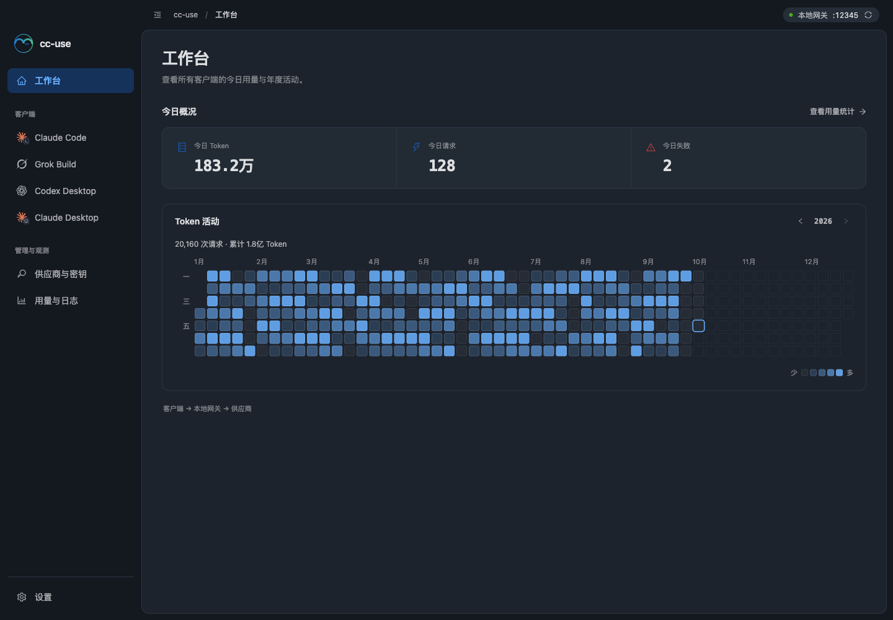
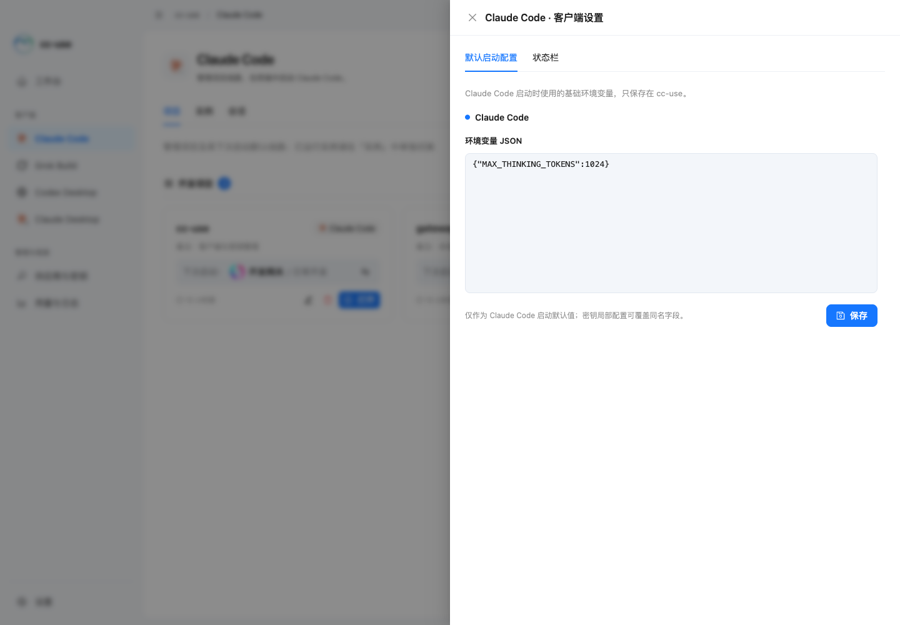

# 工作台 UI

本轮界面调整围绕 cc-use 的日常流程：选择客户端、管理线路和密钥、查看本地网关用量。
视觉参考 [Codex](https://openai.com/codex/) 与 [ZCode](https://zcode.z.ai/en) 的桌面工作区。

## 导航与首页

- 首页「工作台」只展示今日概况与年度活动，不再重复客户端和供应商密钥的全局导航入口。
- 四个客户端与供应商密钥统一从侧栏进入；今日概况保留「查看用量统计」用于继续查看历史明细。
- 左侧「客户端」分组始终显示四个客户端；「管理与观测」包含供应商与密钥，以及合并后的「用量与日志」。
- 「用量与日志」内部切换用量统计和实时控制台，原有统计筛选、请求记录与日志功能继续保留。
- Claude Code 主页面保留项目、实例、会话；默认启动配置和状态栏归入右上角「客户端设置」抽屉。关闭再打开抽屉会保留当前未保存的配置草稿，离开客户端页面后不保留。
- Grok Build 仅展示自己的项目和实例；Claude 会话文件管理只在 Claude Code 中提供。会话清理操作归入「清理会话」菜单，保留原有确认流程。
- 客户端内部页面移除重复的大标题，保留与当前操作有关的提示。
- 设置位于侧栏底部。顶部显示当前页面和本地网关状态，可继续使用原有重启入口。
- 顶部按钮可以收起 / 展开侧栏，选择保存在本机。窄窗口使用图标导航。
- 首页保留今日 Token、请求、失败与年度活动热力图；未获取到用量时显示「—」，失败时提供重试。

## 视觉与操作

浅色使用纯白内容区和明亮浅灰侧栏，正文保持中性深灰。主色使用 Ant Design 默认蓝色 #1677FF，选中背景由其主题算法生成淡蓝色 #E6F4FF；热力图使用更轻的浅蓝色 #69B1FF。状态与品牌图标保留各自的语义色。深色模式采用中性蓝灰背景，不再整屏染成绿色。主题实现参考 [Ant Design 主题规范](https://ant.design/docs/react/customize-theme/)。
供应商使用完整分组边框、组内标题分隔线和独立密钥卡片，便于辨认密钥的归属。项目分组、密钥卡片、统计表格、表单和弹窗共用主题。界面与代码字体均使用本机字体，不请求在线字体。

中文 / 英文和浅色 / 深色 / 跟随系统的选择仍在「设置」中。键盘焦点保持可见，减少动态效果的系统偏好同时应用于自定义样式和 Ant Design 的 motion 设置，以保持弹窗与下拉框正确定位。
客户端启动、线路切换、配置接管、供应商与密钥的数据结构沿用现有业务流程。

左上角使用项目原有 `assets/icon.svg`。客户端统一使用品牌图标；Claude Code / Desktop 使用终端与桌面角标区分，参考 [cc-switch AppSwitcher](https://github.com/farion1231/cc-switch/blob/main/src/components/AppSwitcher.tsx)。Grok 图形来自其图标库，许可证保留在 `src/renderer/assets/licenses/cc-switch-MIT.txt`。

图标、文字、标签和按钮中的图标采用统一的 flex 垂直居中规则。英文切换仍保留在设置中，中文体验优先；原有部分业务文字仍需后续补齐翻译。

## 预览

以下截图使用浏览器演示数据，未访问真实密钥或修改客户端配置。

## 验证范围

发布说明与版本验证见 [v3.12.0](../docs/v3.12.0/README.md)。

- 类型检查、ESLint 和前端生产构建通过。ESLint 有 3 条既有 Hook warning。
- 现有 161 项前端测试及发布说明、构建脚本各 6 项测试通过。
- 浏览器测试覆盖 8 个页面、导航选中状态、侧栏收起、供应商弹窗、主题与语言切换，以及键盘导航和用量失败重试。额外验证用量 / 日志切换、客户端设置抽屉草稿保留、会话清理菜单和 Grok 页面功能归属。
- 1440 × 1000、900 × 760、560 × 760 布局已检查；窄窗口没有文档级横向溢出。
- 浏览器在正常动态效果与减少动态效果两种模式下均通过主题切换、弹窗和新设置抽屉检查。
- 额外验证多供应商分组、真实品牌图标、首页去除重复导航和侧栏 / 客户端标签 22 处中心线对齐（最大偏差 0px）。
- 浏览器检查通过时无 pageerror、无 console error，未调用真实启动 / 接管 / 数据写入接口。
- 本轮未重新执行真实客户端启动与接管的人工验收；安装包由版本标签触发 CI 构建和发布。
